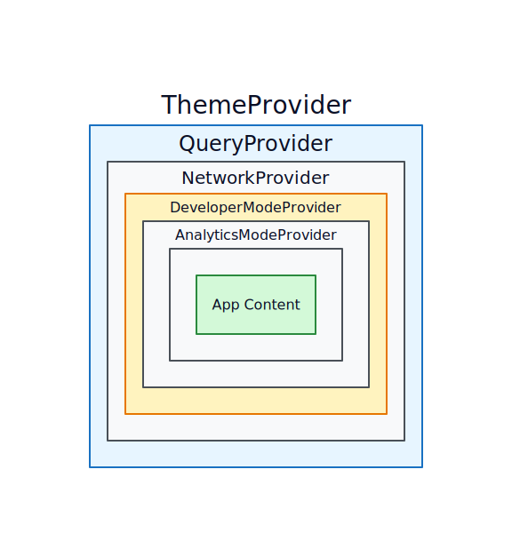

Stellar Explorer usa proveedores de contexto React para compartir estado global. El orden de envoltura importa — los proveedores internos pueden acceder a los externos, pero no al revés.

## Jerarquía de proveedores

Los proveedores envuelven la aplicación en este orden:

| Orden | Proveedor | Propósito | Hook |
|---|---|---|---|
| 1 (externo) | `ThemeProvider` | Modo oscuro/claro | `useTheme()` |
| 2 | `QueryProvider` | Cliente TanStack Query | — |
| 3 | `NetworkProvider` | Red Stellar actual | `useNetwork()` |
| 4 | `DeveloperModeProvider` | Mostrar/ocultar detalles técnicos | `useDeveloperMode()` |
| 5 (interno) | `AnalyticsModeProvider` | Alternar vista de analíticas | `useAnalyticsMode()` |

## Por qué importa el orden

- `NetworkProvider` necesita `QueryProvider` encima para que los cambios de red puedan invalidar consultas
- `DeveloperModeProvider` está debajo de `NetworkProvider` porque las preferencias del modo desarrollador pueden ser específicas de cada red
- `ThemeProvider` es el más externo porque no depende de otros proveedores

**Fuente:** [`apps/explorer-web/src/lib/providers/index.tsx`](https://github.com/salazarsebas/stellar-explorer/blob/main/apps/explorer-web/src/lib/providers/index.tsx)
